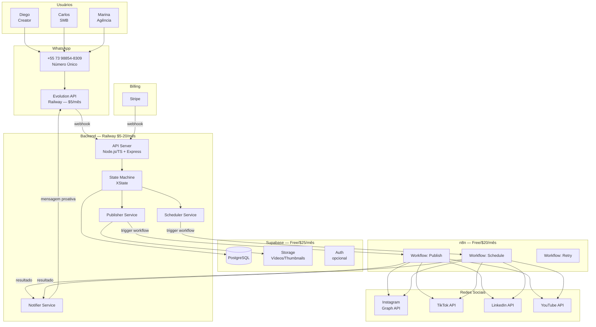
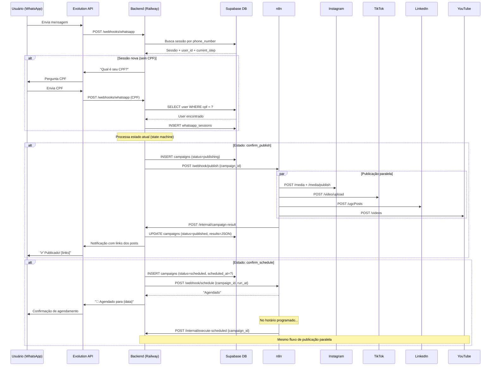

# PostAI — System Architecture

**Versão:** 1.0  
**Autor:** @atlas  
**Data:** 2026-04-08  
**Status:** Draft — pendente review do CEO/Architect

---

## 1. Visão Geral

PostAI é um SaaS de publicação multi-plataforma via WhatsApp. Um único número recebe conteúdo de N usuários (identificados por CPF), processa via state machine e publica em paralelo em Instagram, TikTok, LinkedIn e YouTube.

### Princípios arquiteturais

- **Lean first:** Começar com o mínimo custo viável; escalar quando a receita justificar
- **Portability:** Abstrações que permitem migrar de Supabase → RDS sem reescrita
- **Stateless backend:** Estado de sessão no banco, não na memória — permite escalar horizontal
- **Resilient publishing:** `Promise.allSettled` — falha em 1 plataforma nunca bloqueia as demais
- **Separation of concerns:** WhatsApp layer → State Machine → Publisher Service (independentes)

---

## 2. Fases de Arquitetura

### Fase 1 — MVP Lean (0–200 usuários) ← Começar aqui

```
Custo estimado: R$30–100/mês
Objetivo: validar produto com usuários reais antes de investir em infra
```

### Fase 2 — Crescimento (200–1.000 usuários)

```
Custo estimado: R$250–500/mês
Gatilho: Supabase Free esgotado ou n8n Free esgotado
```

### Fase 3 — Escala (1.000–5.000 usuários)

```
Custo estimado: R$1.000–2.500/mês
Gatilho: Railway não comporta carga ou necessidade de SLA 99.99%
```

### Fase 4 — Enterprise (5.000+ usuários)

```
Custo estimado: R$3.000+/mês
Gatilho: necessidade de multi-region, auto-scaling, Redis cluster
```

---

## 3. Arquitetura MVP (Fase 1)

### 3.1 Diagrama de Componentes



### 3.2 Stack MVP Lean

| Componente | Tecnologia | Plano | Custo/mês |
|-----------|------------|-------|-----------|
| Backend | Node.js 20 + TypeScript + Express | Railway Hobby | ~R$25 |
| WhatsApp | Evolution API | Railway (mesmo servidor) | R$0 extra |
| Database | PostgreSQL via Supabase | Free (500MB) | R$0 |
| Storage | Supabase Storage | Free (1GB) | R$0 |
| Workflows | n8n Cloud | Free (5k execuções) | R$0 |
| Billing | Stripe | Pay-as-you-go | ~0.5% por transação |
| Domínio | postai.app | Namecheap/Registro.br | ~R$50/ano |
| **Total** | | | **~R$25–50/mês** |

### 3.3 Por que n8n ao invés de BullMQ + Redis?

No MVP, n8n substitui toda a camada de queue/jobs:

| Funcionalidade | BullMQ + Redis | n8n |
|---------------|----------------|-----|
| Publicação paralela | `Promise.allSettled` no código | Workflow com branches paralelas |
| Retry com backoff | Configuração manual | Built-in no node |
| Agendamento | Delayed jobs | Cron trigger + Wait node |
| Observabilidade | Logs manuais | Dashboard visual de execuções |
| Custo MVP | ~R$80/mês (Redis) | R$0 (free tier) |
| Migração futura | N/A | Gradual — manter n8n ou repatriar para BullMQ |

> **Quando migrar para BullMQ:** quando n8n Cloud ultrapassar R$200/mês ou quando precisar de <500ms de latência de publicação (n8n adiciona ~1–2s de overhead).

### 3.4 Por que Supabase ao invés de AWS RDS?

| Critério | Supabase | AWS RDS |
|---------|----------|---------|
| Custo MVP | R$0 (free) | ~R$150/mês (db.t3.micro) |
| Setup | 5 minutos | 2–4 horas (VPC, security groups) |
| Managed backups | ✅ Built-in | ✅ Configuração extra |
| Storage de vídeos | ✅ Built-in (1GB free) | ❌ S3 separado |
| Migração para RDS | ✅ pg_dump + trocar DATABASE_URL | N/A |
| Prisma compatível | ✅ 100% | ✅ 100% |

---

## 4. Fluxo de Publicação (Sequência)



---

## 5. Schema do Banco (Prisma)

```prisma
// schema.prisma

generator client {
  provider = "prisma-client-js"
}

datasource db {
  provider = "postgresql"
  url      = env("DATABASE_URL") // Supabase no MVP, RDS na escala
}

model User {
  id                  String   @id @default(uuid())
  email               String   @unique
  cpf                 String   @unique  // sem máscara: "73988548309"
  cpfMasked           String            // "739.885.483-09" (display)
  name                String
  passwordHash        String
  plan                Plan     @default(FREE)
  status              UserStatus @default(PENDING_PAYMENT)
  stripeCustomerId    String?  @unique
  stripeSubscriptionId String? @unique
  createdAt           DateTime @default(now())
  updatedAt           DateTime @updatedAt

  sessions            WhatsappSession[]
  apiTokens           ApiToken[]
  campaigns           Campaign[]
  agencyClients       AgencyClient[]

  @@index([cpf])
}

model WhatsappSession {
  id              String   @id @default(uuid())
  userId          String
  phoneNumber     String   // número do WhatsApp do user
  currentStep     String   @default("menu")
  campaignDraft   Json?    // rascunho em progresso
  activeClientId  String?  // para agências
  status          SessionStatus @default(ACTIVE)
  sessionStarted  DateTime @default(now())
  lastMessage     DateTime @default(now())

  user            User     @relation(fields: [userId], references: [id])
  activeClient    AgencyClient? @relation(fields: [activeClientId], references: [id])

  @@index([phoneNumber, status])
  @@index([userId, status])
}

model ApiToken {
  id            String   @id @default(uuid())
  userId        String
  clientId      String?  // null = token do próprio usuário; preenchido = token de cliente de agência
  platform      Platform
  accountName   String   // "@seu_perfil"
  accessToken   String   // criptografado
  refreshToken  String?  // criptografado
  expiresAt     DateTime?
  createdAt     DateTime @default(now())

  user          User     @relation(fields: [userId], references: [id])
  client        AgencyClient? @relation(fields: [clientId], references: [id])

  @@unique([userId, platform, clientId])
  @@index([userId])
  @@index([clientId])
}

model AgencyClient {
  id            String   @id @default(uuid())
  agencyUserId  String
  name          String
  segment       String?
  notes         String?
  createdAt     DateTime @default(now())

  agencyUser    User     @relation(fields: [agencyUserId], references: [id])
  tokens        ApiToken[]
  campaigns     Campaign[]
  sessions      WhatsappSession[]

  @@index([agencyUserId])
}

model Campaign {
  id            String   @id @default(uuid())
  userId        String
  clientId      String?  // para agências
  originalCopy  String
  videoUrl      String?  // Supabase Storage URL no MVP
  thumbnailUrl  String?
  platforms     Platform[]
  status        CampaignStatus @default(DRAFT)
  scheduledAt   DateTime?
  publishedAt   DateTime?
  results       Json?    // { instagram: {success, postId, url}, ... }
  n8nJobId      String?  // ID do job no n8n para cancelamento
  createdAt     DateTime @default(now())

  user          User     @relation(fields: [userId], references: [id])
  client        AgencyClient? @relation(fields: [clientId], references: [id])

  @@index([userId, status])
  @@index([clientId])
  @@index([scheduledAt, status])
}

enum Plan {
  FREE
  CREATOR   // R$49/mês
  BUSINESS  // R$149/mês
  AGENCY    // R$399/mês
  AGENCY_PRO
}

enum UserStatus {
  PENDING_PAYMENT
  ACTIVE
  PAST_DUE
  CANCELLED
}

enum SessionStatus {
  ACTIVE
  EXPIRED
  CLOSED
}

enum Platform {
  INSTAGRAM
  TIKTOK
  LINKEDIN
  YOUTUBE
}

enum CampaignStatus {
  DRAFT
  SCHEDULED
  PUBLISHING
  PUBLISHED
  PARTIAL_FAILURE
  FAILED
  CANCELLED
}
```

---

## 6. Estrutura de Pastas do Projeto

```
src/
├── api/
│   ├── controllers/
│   │   ├── auth.controller.ts
│   │   ├── billing.controller.ts
│   │   ├── campaign.controller.ts
│   │   └── agency.controller.ts
│   ├── middlewares/
│   │   ├── auth.middleware.ts
│   │   ├── plan-guard.middleware.ts
│   │   └── validate.middleware.ts
│   ├── routes/
│   │   └── index.ts
│   └── webhooks/
│       ├── whatsapp.webhook.ts
│       └── stripe.webhook.ts
├── services/
│   ├── whatsapp/
│   │   ├── session-manager.ts
│   │   ├── state-machine.ts      // XState
│   │   ├── cpf-validator.ts
│   │   ├── date-parser.ts        // chrono-node PT-BR
│   │   ├── menu-handler.ts
│   │   ├── media-handler.ts      // upload para Supabase Storage
│   │   └── agency-context.ts
│   ├── publishing/
│   │   ├── publisher.service.ts  // orquestra n8n workflow
│   │   └── post-link-builder.ts
│   ├── notifications/
│   │   └── whatsapp-notifier.ts
│   ├── scheduling/
│   │   └── scheduler.service.ts  // trigger n8n schedule workflow
│   ├── oauth/
│   │   ├── instagram.oauth.ts
│   │   ├── tiktok.oauth.ts
│   │   ├── linkedin.oauth.ts
│   │   └── youtube.oauth.ts
│   ├── auth/
│   │   └── register.service.ts
│   └── billing/
│       └── stripe.service.ts
├── repositories/
│   ├── user.repository.ts
│   ├── session.repository.ts
│   ├── campaign.repository.ts
│   ├── api-token.repository.ts
│   └── agency-client.repository.ts
├── domain/
│   ├── user.types.ts
│   ├── campaign.types.ts
│   └── platform.types.ts
├── lib/
│   ├── prisma.ts                 // Prisma client singleton
│   ├── supabase.ts               // Supabase Storage client
│   └── n8n.ts                   // n8n webhook client
└── index.ts
```

---

## 7. n8n — Workflows

### Workflow 1: Publish Content

```
Trigger: Webhook POST /webhook/publish
  ↓
Node: Get Campaign (HTTP Request → Backend API)
  ↓
Node: Get API Tokens (HTTP Request → Backend API)
  ↓
Branches paralelas (Execute in Parallel):
  ├── Branch Instagram: HTTP Request → Graph API → Extract post_id
  ├── Branch TikTok:    HTTP Request → TikTok API → Extract video_id
  ├── Branch LinkedIn:  HTTP Request → LinkedIn API → Extract post_id
  └── Branch YouTube:   HTTP Request → YouTube API → Extract video_id
  ↓
Node: Merge Results (Merge node — wait all)
  ↓
Node: Update Campaign (HTTP Request → POST /internal/campaign-result)
  ↓
Node: Send Notification (HTTP Request → POST /internal/notify)
```

### Workflow 2: Schedule + Execute

```
Trigger: Webhook POST /webhook/schedule
  ↓
Node: Wait (DateTime — até o horário agendado)
  ↓
Node: Check Campaign Status (verificar se não foi cancelado)
  ↓
[Se SCHEDULED] → Sub-workflow: Publish Content (reusa Workflow 1)
[Se CANCELLED] → Stop
```

### Workflow 3: Retry Failures

```
Trigger: Webhook POST /webhook/retry
  ↓
Node: Get Failed Platforms (filtra campaign.results onde success=false)
  ↓
Branches paralelas (apenas plataformas que falharam)
  ↓
Node: Merge + Update Campaign Result
  ↓
Node: Send Notification
```

---

## 8. Plano de Escala

### Fase 1 → 2 (gatilho: >200 usuários ou Supabase Free esgotado)

```diff
- Supabase Free (500MB, 1GB storage)
+ Supabase Pro ($25/mês: 8GB DB, 250GB storage, backups diários)

- n8n Free (5.000 execuções/mês)
+ n8n Starter ($20/mês: 10.000 execuções)

- Railway Hobby ($5/mês)
+ Railway Pro ($20/mês: mais CPU/RAM, SLA 99.9%)
```

**Custo total Fase 2: ~R$350/mês**

### Fase 2 → 3 (gatilho: >1.000 usuários ou Railway não comporta)

```diff
- Railway
+ AWS ECS Fargate (auto-scaling, SLA 99.99%)

Manter Supabase Pro OU migrar para AWS RDS:
  Migração: pg_dump | pg_restore + trocar DATABASE_URL
  Zero reescrita de código (Prisma abstrai)

+ Redis (Upstash ou ElastiCache) para cache de sessões
  (reduz queries no DB para sessões WhatsApp ativas)

- Supabase Storage para vídeos
+ AWS S3 + CloudFront (reduz latência de upload)
```

**Custo total Fase 3: ~R$1.200–2.000/mês**

### Fase 3 → 4 (gatilho: >5.000 usuários)

```diff
+ BullMQ + Redis em substituição ao n8n
  (quando overhead do n8n for crítico para latência)

+ Read replicas no RDS
+ Multi-AZ deployment
+ Auto-scaling groups
+ CDN para assets estáticos
```

**Custo total Fase 4: ~R$4.000+/mês**

---

## 9. Estimativa de Capacidade

| Métrica | Fase 1 (Railway+Supabase) | Fase 3 (AWS) |
|---------|--------------------------|--------------|
| Usuários simultâneos | ~200 | ~5.000 |
| Posts/dia | ~1.000 | ~25.000 |
| Latência API (p95) | ~200ms | <100ms |
| Latência publicação | ~3–5s | <3s |
| Uptime SLA | ~99.5% | 99.99% |
| Storage vídeos | 1GB (free) | Ilimitado (S3) |

---

## 10. Segurança

### Camadas de proteção

1. **API Tokens:** AES-256 encryption via Supabase Vault (MVP) ou AWS Secrets Manager (escala)
2. **Senhas:** bcrypt, salt rounds 12
3. **CPF:** armazenado sem máscara, apenas para lookup — nunca exposto em responses
4. **Stripe Webhook:** assinatura verificada via `stripe.webhooks.constructEvent`
5. **WhatsApp Webhook:** verificar `X-Hub-Signature-256` da Evolution API
6. **JWT:** tokens de curta duração (15min) + refresh tokens (7 dias)
7. **Rate limiting:** `express-rate-limit` — max 100 req/min por IP no webhook

### LGPD

- Checkbox de aceite nos termos e política de privacidade no cadastro
- CPF criptografado em repouso (Supabase Vault)
- Direito ao esquecimento: `DELETE /api/me` → cascade deletes + revogação de tokens OAuth
- Logs de publicação retidos por 90 dias, depois deletados automaticamente

---

## 11. ADRs (Architecture Decision Records)

- [ADR-001](adr/ADR-001-cpf-como-identificador.md) — CPF como identificador único no WhatsApp
- [ADR-002](adr/ADR-002-supabase-lean-mvp.md) — Supabase ao invés de AWS RDS no MVP
- [ADR-003](adr/ADR-003-n8n-ao-inves-de-bullmq.md) — n8n ao invés de BullMQ para publicação

---

## 12. Próximos Passos

| Ordem | Tarefa | Agente | Story |
|-------|--------|--------|-------|
| 1 | Setup Supabase + Prisma schema | @cipher | 3.1 |
| 2 | Billing (Stripe + webhook) | @harmony | 4.1 |
| 3 | OAuth Instagram + TikTok + LinkedIn + YouTube | @velocity | 3.2 |
| 4 | Evolution API + webhook handler | @cipher | 1.1 |
| 5 | State Machine (XState) | @cipher | 1.2 |
| 6 | n8n workflows de publicação | @velocity | 2.1 |
| 7 | Notificações com links | @cipher/@velocity | 4.3 |
| 8 | Agendamento (n8n schedule) | @cipher | 4.2 |
| 9 | Gestão de agência | @cipher | 1.3, 3.3 |
| 10 | Testes + load test | @sentinel | — |
